# TrueMark Mint Ontology Graph

This document visualizes the `truemark_mint` domain as a directed, weighted, temporal knowledge graph for CALI Orbs.

Locked hierarchy:
- `TrueMark Mint` is the visible root and external issuer.
- `CertSig` is the hidden certification engine.
- No brand inversion or CertSig surface leakage is permitted.

Graph properties:
- Directed: primary runtime flow is `asset -> use_case -> value_channel`.
- Weighted: link strength and mandatory status encode priority and enforcement.
- Temporal: cross-link files use `valid_from` and `valid_to`.
- Multi-hop: Orbs can traverse across assets, certification, monetization, and market positioning.
- Additive: the graph extends the base taxonomy without changing it.

## Source Files

Base domain files:
- `truemark_asset_types.csv`
- `truemark_use_cases.csv`
- `truemark_market_model.csv`
- `truemark_cert_layers.csv`
- `truemark_value_channels.csv`
- `truemark_system_map.csv`

Cross-link files:
- `truemark_asset_to_usecase_links.csv`
- `truemark_usecase_to_valuechannel_links.csv`
- `truemark_asset_to_certlayer_bindings.csv`
- `truemark_financial_domain_integration.csv`

## Overall Graph Architecture

Layers of the graph:
- Root / system hierarchy: `TrueMark Mint` depends on `CertSig`, `GOAT`, `CALI Core`, and `Orb Interface`.
- Asset layer: minted products such as `knft`, `hnft`, `lnft`, `enft`, `mnft`, and `cnft`.
- Use case layer: practical application paths that give assets purpose.
- Value channel layer: monetization and internal-value flows.
- Certification layer: hidden CertSig bindings plus limited visible trust surfaces.
- Market model layer: strategic positioning and defensibility guardrails.

Primary traversal path:

`asset -> use_case -> value_channel -> market_model`

Support paths:
- `asset -> certification_layer`
- `system -> system dependency`
- `asset -> use_case -> financial integration override`

## Mermaid Diagram

```mermaid
flowchart TD
    TM["TrueMark Mint<br/>Primary External Brand and Issuance System"]:::root
    CS["CertSig<br/>Hidden Certification Engine"]:::system
    GOAT["GOAT Preservation System"]:::system
    CALI["CALI Core"]:::system
    ORB["Orb Interface"]:::system

    subgraph Assets["Assets (License-First Knowledge Products)"]
        KNFT["knft<br/>Knowledge Asset (K-NFT)"]:::asset
        HNFT["hnft<br/>Heirloom Asset (H-NFT)"]:::asset
        LNFT["lnft<br/>Legacy Asset (L-NFT)"]:::asset
        ENFT["enft<br/>Enterprise Asset (E-NFT)"]:::asset
        MNFT["mnft<br/>Master Template (M-NFT)"]:::asset
        CNFT["cnft<br/>Certificate Preview (C-NFT)"]:::preview
    end

    subgraph UseCases["Use Cases"]
        EXP["expert_packaging<br/>Expert Knowledge Packaging"]:::usecase
        FAM["family_preservation<br/>Family Preservation"]:::usecase
        SYS["system_documentation<br/>System Documentation"]:::usecase
        TRAIN["training_delivery<br/>Training Delivery"]:::usecase
        IP["ip_structuring<br/>IP Structuring"]:::usecase
        AUDIT["audit_record<br/>Audit and Compliance"]:::usecase
    end

    subgraph Value["Value Channels"]
        DIRECT["direct_issue<br/>Direct Issuance"]:::value
        LIC["licensed_access<br/>Licensed Access"]:::value
        DERIV["derivative_royalty<br/>Derivative Royalty"]:::value
        EDU["education_use<br/>Educational Deployment"]:::value
        ADV["advisory_support<br/>Advisory Extension"]:::value
        INT["internal_use<br/>Internal Integration"]:::value
    end

    subgraph Cert["Certification Layers (CertSig - Internal)"]
        ID["layer_identity"]:::cert
        LICL["layer_license"]:::cert
        REND["layer_render"]:::visible
        HASH["layer_hash"]:::cert
        SIG["layer_signature"]:::cert
        TS["layer_timestamp"]:::cert
        CHAIN["layer_chain"]:::cert
        AUD["layer_audit"]:::cert
        QR["layer_qr"]:::visible
    end

    subgraph Market["Market Models"]
        LF["license_first"]:::market
        UTIL["utility_value"]:::market
        PRES["preservation_core"]:::market
        OP["operator_control"]:::market
        PLAT["platform_independent"]:::market
    end

    TM -->|depends_on| CS
    TM -->|depends_on| GOAT
    TM -->|depends_on| CALI
    TM -->|user_surface| ORB

    KNFT -->|strong| EXP
    KNFT -->|medium| TRAIN
    HNFT -->|strong| FAM
    LNFT -->|strong| SYS
    ENFT -->|strong| IP
    ENFT -->|strong| AUDIT
    MNFT -->|strong| EXP
    CNFT -->|weak,time_limited| TRAIN

    KNFT -->|mandatory| ID
    KNFT -->|mandatory| LICL
    KNFT -->|mandatory| REND
    HNFT -->|mandatory| TS
    HNFT -->|optional| AUD
    ENFT -->|mandatory| CHAIN
    ENFT -->|mandatory| AUD
    CNFT -->|mandatory| QR

    EXP -->|high| DIRECT
    EXP -->|high| LIC
    FAM -->|medium,passive| DERIV
    SYS -->|medium| INT
    IP -->|high| LIC
    AUDIT -->|medium| ADV
    TRAIN -->|high| EDU

    KNFT -.->|via expert_packaging/direct_issue| LF
    HNFT -.->|via family_preservation/derivative_royalty| PRES
    ENFT -.->|via ip_structuring/licensed_access| OP
    LNFT -.->|via audit_record/advisory_support| UTIL
    PLAT -.->|validity guardrail| TM

    classDef root fill:#d6ecff,stroke:#1e88e5,stroke-width:4px,color:#000
    classDef asset fill:#fff0dd,stroke:#ef6c00,stroke-width:2px,color:#000
    classDef preview fill:#fde7e9,stroke:#d32f2f,stroke-width:2px,color:#000
    classDef usecase fill:#e6f4ea,stroke:#2e7d32,stroke-width:2px,color:#000
    classDef value fill:#ffe9ea,stroke:#c62828,stroke-width:2px,color:#000
    classDef cert fill:#f3f3f3,stroke:#757575,stroke-width:2px,color:#000
    classDef visible fill:#e6f4ea,stroke:#2e7d32,stroke-width:3px,color:#000
    classDef market fill:#ede7f6,stroke:#5e35b1,stroke-width:2px,color:#000
    classDef system fill:#f3e5f5,stroke:#8e24aa,stroke-width:3px,color:#000
```



Diagram note:
- `enft` routes to `operator_control` through financial integration.
- `lnft` routes to `utility_value` through financial integration.
- This matches `truemark_financial_domain_integration.csv`.

## Hierarchical View

```text
TrueMark Mint
|- Assets
|  |- knft -> expert_packaging -> direct_issue / licensed_access -> license_first
|  |- hnft -> family_preservation -> derivative_royalty -> preservation_core
|  |- lnft -> system_documentation -> internal_use
|  |- lnft -> audit_record -> advisory_support -> utility_value
|  |- enft -> ip_structuring -> licensed_access -> operator_control
|  |- enft -> audit_record -> advisory_support
|  |- mnft -> expert_packaging
|  `- cnft -> training_delivery -> education_use
|- CertSig Layers
|  |- knft -> layer_identity, layer_license, layer_render
|  |- hnft -> layer_timestamp, layer_audit(optional)
|  |- enft -> layer_chain, layer_audit
|  `- cnft -> layer_qr
`- Systems
   |- CertSig
   |- GOAT Preservation System
   |- CALI Core
   `- Orb Interface
```

## Key Paths and Edge Cases

### High-Revenue Enterprise Path

`enft -> ip_structuring -> licensed_access -> operator_control -> layer_chain + layer_audit`

Implications:
- White-label capable enterprise packaging.
- Recurring revenue through controlled access.
- Strong compliance posture for audits and enterprise deployment.

Edge cases:
- Overly broad licenses trigger dilution review.
- Chain-specific outage requires fallback anchoring.
- Audit logs must remain attached indefinitely.

### Generational Preservation Path

`hnft -> family_preservation -> derivative_royalty -> preservation_core -> layer_timestamp`

Implications:
- Multi-generational preservation and inheritance positioning.
- Passive revenue potential across heir or family-line usage.
- Emotional and legal defensibility are both first-class concerns.

Edge cases:
- Multi-party consent workflow is mandatory.
- Ownership disputes should escalate to audit-supported review where available.
- Key rotation and inheritance handling must remain deterministic.

### Atomic Packaging Path

`knft -> expert_packaging -> direct_issue + licensed_access -> layer_identity + layer_license + layer_render`

Implications:
- Granular monetization and derivative-friendly packaging.
- Suitable atomic unit for licensing, training, and bundling.
- Strong fit for repeatable expert-method packaging.

Edge cases:
- Low content completeness should route to advisory-first handling.
- Orphaned content auto-archives after long inactivity.
- License conflicts must resolve in favor of TrueMark priority rules.

### Preview and Onboarding Path

`cnft -> training_delivery -> education_use -> layer_qr`

Implications:
- Safe preview and onboarding artifact.
- Useful for sales, demos, and limited-scope verification.

Edge cases:
- Preview links are weak and time-limited.
- Expiry and watermark semantics must remain enforced.
- `cnft` must never be treated as a final production asset.

## How Orbs Traverse the Graph

- General Orb: broad traversal with TrueMark-first explanations and asset-to-use-case reasoning.
- Enterprise Orb: prioritizes `enft`, `audit_record`, `licensed_access`, `layer_chain`, and `layer_audit`.
- Heirloom Orb: prioritizes `hnft`, `family_preservation`, `derivative_royalty`, and `layer_timestamp`.
- Training-oriented Orb: prioritizes `knft`, `cnft`, `training_delivery`, and `education_use`.
- Multi-hop reasoning: queries such as `assets supporting derivative revenue with multi-chain trust` can be answered through composed traversal rather than prompt heuristics.

## Governance Notes

- Temporal enforcement is defined by `valid_from` and `valid_to` in the cross-link CSVs.
- Mandatory certification layers cannot be bypassed.
- Cross-link files are additive and do not alter the base taxonomy.
- Financial integration rows should be treated as explicit path overrides where present.
- CertSig remains internal even when render or QR output is user-visible.

## Improvement Targets

One material graph improvement remains available:
- `truemark_cert_layers.csv` marks several layers as `required_for = All assets`, but `truemark_asset_to_certlayer_bindings.csv` materializes only selected bindings. If you want single-pass traversal with no inheritance logic, expand the link file to include the global bindings explicitly.

Optional next extensions:
- Add revenue weight or risk score columns to link files.
- Add a `truemark_link_rules.csv` for conflict-resolution policy.
- Export the graph to DOT or JSON for dashboard or runtime rendering.
